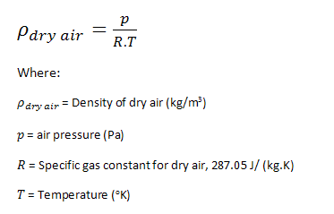
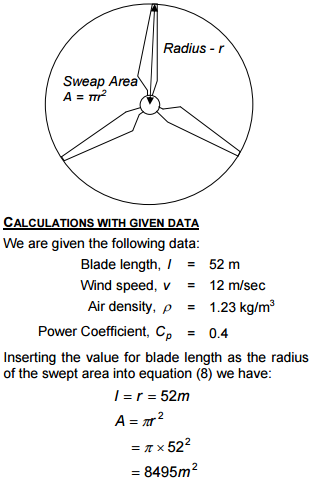

# Wind Turbine Kinetic Energy Finder

By: Andrew Cho

## Description

A web application built to find the kinetic energy of a wind turbine placed in a specific point based on the input of the user(Latitude and Longitude). I primarily built this in ASP.NET using the Dark Sky Forecast Api. 

I used the formula below to find air density(it is assumed the air is dry): 

I also factored in <strong>Betz's Limit/Law</strong> which states that a wind turbine can only store up to 59.3% of wind to mechanical energy. An industrial wind turbine typically only gathers around 35%-45% of energy so I averaged the two and the power coeffiecent came out to .4

I then found the radius of the blade length by choosing the most popular type of wind turbine out there: the GE 1.5.

Below is the formula used to find sweap area of the wind turbine with an example

I then input all these values, as well as others gathered from the Dark Sky Weather Api to get the outputed kinetic energy at that location in that specific point in time.

## Setup/Installation Requirements
* Clone the repository.
* Open in Visual Studio.
* Import database file.
* Start IIS Express server.

## Known Bugs
No known bugs!

## Technologies Used

* HTML5
* CSS3
* Bootstrap 3
* C#
* ASP.NET 5
* MVC 6
* Visual Studio 2015
* SSMS 

## Special Thanks
<h6>Formula for air density: http://www.brisbanehotairballooning.com.au/calculate-air-density/</h6>
<h6>The Royal Academy of Engineering: http://www.raeng.org.uk/publications/other/23-wind-turbine</h6>

## Support and contact details
If you have any comments/concerns, or would just like to talk to me please contact me at cho-andrew@hotmail.com

## MIT License

*This software is licensed under the MIT license.*

Copyright (c) [2016] [Andrew Cho]

Permission is hereby granted, free of charge, to any person obtaining a copy
of this software and associated documentation files (the "Software"), to deal
in the Software without restriction, including without limitation the rights
to use, copy, modify, merge, publish, distribute, sublicense, and/or sell
copies of the Software, and to permit persons to whom the Software is
furnished to do so, subject to the following conditions:

The above copyright notice and this permission notice shall be included in all
copies or substantial portions of the Software.

THE SOFTWARE IS PROVIDED "AS IS", WITHOUT WARRANTY OF ANY KIND, EXPRESS OR
IMPLIED, INCLUDING BUT NOT LIMITED TO THE WARRANTIES OF MERCHANTABILITY,
FITNESS FOR A PARTICULAR PURPOSE AND NONINFRINGEMENT. IN NO EVENT SHALL THE
AUTHORS OR COPYRIGHT HOLDERS BE LIABLE FOR ANY CLAIM, DAMAGES OR OTHER
LIABILITY, WHETHER IN AN ACTION OF CONTRACT, TORT OR OTHERWISE, ARISING FROM,
OUT OF OR IN CONNECTION WITH THE SOFTWARE OR THE USE OR OTHER DEALINGS IN THE
SOFTWARE.
